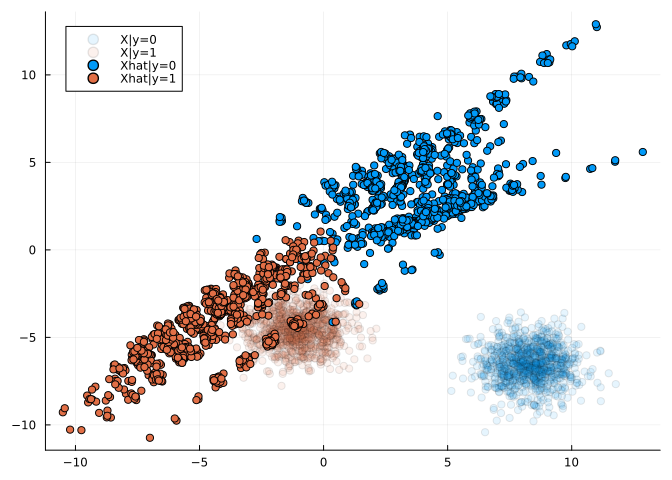

# EnergySamplers

[](https://JuliaTrustworthyAI.github.io/EnergySamplers.jl/stable/) [](https://JuliaTrustworthyAI.github.io/EnergySamplers.jl/dev/) [](https://github.com/JuliaTrustworthyAI/EnergySamplers.jl/actions/workflows/CI.yml?query=branch%3Amain) [](https://codecov.io/gh/JuliaTrustworthyAI/EnergySamplers.jl) [](https://github.com/invenia/BlueStyle) [](https://github.com/JuliaTesting/Aqua.jl)

`EnergySamplers.jl` is a small and lightweight package for sampling from probability distributions using methods from energy-based modelling (EBM). Its functionality is used in other \[Taija\] packages, including [JointEnergyModels.jl](https://github.com/JuliaTrustworthyAI/JointEnergyModels.jl) and [CounterfactualExplanations.jl](https://github.com/JuliaTrustworthyAI/CounterfactualExplanations.jl).

## Extensions to [Optimisers.jl](https://fluxml.ai/Optimisers.jl/stable/)

The package adds two new optimisers that are compatible with the [Optimisers.jl](https://fluxml.ai/Optimisers.jl/stable/) interface:

1.  Stochastic Gradient Langevin Dynamics (SGLD) (Welling and Teh 2011) — [`SGLD`](@ref).
2.  Improper SGLD (see, for example, Grathwohl et al. (2020)) — [`ImproperSGLD`](@ref).

SGLD is an efficient gradient-based Markov Chain Monte Carlo (MCMC) method that can be used in the context of EBM to draw samples from the model posterior (Murphy 2023). Formally, we can draw from $p_{\theta}(\mathbf{x})$ as follows

$$
\begin{aligned}
    \mathbf{x}_{j+1} &\leftarrow \mathbf{x}_j - \frac{\epsilon_j^2}{2} \nabla_x \mathcal{E}_{\theta}(\mathbf{x}_j) + \epsilon_j \mathbf{r}_j, && j=1,...,J
\end{aligned}
$$

where $\mathbf{r}_j \sim \mathcal{N}(\mathbf{0},\mathbf{I})$ is a stochastic term and the step-size $\epsilon_j$ is typically polynomially decayed (Welling and Teh 2011). To allow for faster sampling, it is common practice to choose the step-size $\epsilon_j$ and the standard deviation of $\mathbf{r}_j$ separately. While $\mathbf{x}_J$ is only guaranteed to distribute as $p_{\theta}(\mathbf{x})$ if $\epsilon \rightarrow 0$ and $J \rightarrow \infty$, the bias introduced for a small finite $\epsilon$ is negligible in practice (Murphy 2023). We denote this form of sampling as Improper SGLD.

### Example: Bayesian Inferecne with SGLD

To illustrate how the custom optimisers can be used, we will go through an example adapted from this (great!) blog [post](https://sebastiancallh.github.io/post/langevin/) by Sebastian Callh. First, let’s load some dependencies:

``` julia
# External dependencies:
using Flux
using Flux: gpu
using MLDataUtils: shuffleobs, stratifiedobs, rescale!
using Plots
using Random
using RDatasets 
using Statistics
# Custom optimisers:
using EnergySamplers: ImproperSGLD, SGLD
```

Next, we load some data and prepare it for training a logistic regression model in [Flux.jl](https://fluxml.ai/Flux.jl/stable/):

``` julia
Random.seed!(2024)

data = dataset("ISLR", "Default")
todigit(x) = x == "Yes" ? 1.0 : 0.0
data[!, :Default] = map(todigit, data[:, :Default])
data[!, :Student] = map(todigit, data[:, :Student])

target = :Default
numerics = [:Balance, :Income]
features = [:Student, :Balance, :Income]
train, test = (d -> stratifiedobs(first, d; p=0.7))(shuffleobs(data))

for feature in numerics
    μ, σ = rescale!(train[!, feature]; obsdim=1)
    rescale!(test[!, feature], μ, σ; obsdim=1)
end

prep_X(x) = gpu(Matrix(x)')
prep_y(y) = gpu(reshape(y, 1, :))
train_X, test_X = prep_X.((train[:, features], test[:, features]))
train_y, test_y = prep_y.((train[:, target], test[:, target]))
train_set = Flux.DataLoader((train_X, train_y); batchsize=100, shuffle=false)
```

\[36m\[1m┌ \[22m\[39m\[36m\[1mInfo: \[22m\[39mThe CUDA functionality is being called but \[36m\[1m│ \[22m\[39m`CUDA.jl` must be loaded to access it. \[36m\[1m└ \[22m\[39mAdd `using CUDA` or `import CUDA` to your code. Alternatively, configure a different GPU backend by calling `Flux.gpu_backend!`.

    70-element DataLoader(::Tuple{LinearAlgebra.Adjoint{Float64, Matrix{Float64}}, Matrix{Float64}}, batchsize=100)
      with first element:
      (3×100 Matrix{Float64}, 1×100 Matrix{Float64},)

Finally, we create a small helper function that runs the training loop for a given optimiser `opt` and number of `steps`:

``` julia
function train_logreg(; steps::Int=1000, opt=Flux.Descent(2))
    Random.seed!(1)

    paramvec(θ) = reduce(hcat, cpu(θ))
    model = gpu(Dense(length(features), 1, sigmoid))
    θ = Flux.params(model)
    θ₀ = paramvec(θ)

    predict(x; thres=0.5) = model(x) .> thres
    accuracy(x, y) = mean(cpu(predict(x)) .== cpu(y))

    loss(yhat, y) = Flux.binarycrossentropy(yhat, y)
    avg_loss(yhat, y) = mean(loss(yhat, y))
    trainloss() = avg_loss(model(train_X), train_y)
    testloss() = avg_loss(model(test_X), test_y)

    trainlosses = [cpu(trainloss()); zeros(steps)]
    testlosses = [cpu(testloss()); zeros(steps)]
    weights = [cpu(θ₀); zeros(steps, length(θ₀))]

    opt_state = Flux.setup(opt, model)

    for t in 1:steps
        for data in train_set
            input, label = data

            # Calculate the gradient of the objective
            # with respect to the parameters within the model:
            grads = Flux.gradient(model) do m
                result = m(input)
                loss(result, label)
            end

            Flux.update!(opt_state, model, grads[1])
        end

        # Bookkeeping
        weights[t + 1, :] = cpu(paramvec(θ))
        trainlosses[t + 1] = cpu(trainloss())
        testlosses[t + 1] = cpu(testloss())
    end

    println("Final parameters are $(paramvec(θ))")
    println("Test accuracy is $(accuracy(test_X, test_y))")

    return model, weights, trainlosses, testlosses
end
```

    train_logreg (generic function with 1 method)

Now we use this function to train the model, first using SGLD and then using Improper SGLD:

``` julia
results = train_logreg(; steps=100, opt=SGLD(10.0, 10.0, 0.9))
model, weights, trainlosses, testlosses = results
p1 = plot(weights; label=["Student" "Balance" "Income" "Intercept"], plot_title="SGLD")

results = train_logreg(; steps=100, opt=ImproperSGLD(2.0, 0.01))
model, weights, trainlosses, testlosses = results
p2 = plot(weights; label=["Student" "Balance" "Income" "Intercept"], plot_title="Improper SGLD")

plot(p1, p2, size=(800, 400))
```

\[36m\[1m┌ \[22m\[39m\[36m\[1mInfo: \[22m\[39mThe CUDA functionality is being called but \[36m\[1m│ \[22m\[39m`CUDA.jl` must be loaded to access it. \[36m\[1m└ \[22m\[39mAdd `using CUDA` or `import CUDA` to your code. Alternatively, configure a different GPU backend by calling `Flux.gpu_backend!`. \[33m\[1m┌ \[22m\[39m\[33m\[1mWarning: \[22m\[39mLayer with Float32 parameters got Float64 input. \[33m\[1m│ \[22m\[39m The input will be converted, but any earlier layers may be very slow. \[33m\[1m│ \[22m\[39m layer = Dense(3 =\> 1, σ) \[90m# 4 parameters\[39m \[33m\[1m│ \[22m\[39m summary(x) = “3×7000 adjoint(::Matrix{Float64}) with eltype Float64” \[33m\[1m└ \[22m\[39m\[90m@ Flux ~/.julia/packages/Flux/HBF2N/src/layers/stateless.jl:60\[39m Final parameters are Float32\[-2.3311744 1.1305944 -1.5102222 -4.0762844\] Test accuracy is 0.9666666666666667 Final parameters are Float32\[-0.6106307 2.760134 -0.031244753 -5.8856964\] Test accuracy is 0.9763333333333334 

## Energy-Based Samplers

In the context of EBM, the optimisers can be used to sample from a model posterior. To this end, the package provides the following samples:

1.  [`UnconditionalSampler`](@ref) — samples from the unconditional distribution $p_{\theta}(\mathbf{x})$ as in Grathwohl et al. (2020).
2.  [`ConditionalSampler`](@ref) — samples from the conditional distribution $p_{\theta}(\mathbf{x}|y)$ as in Grathwohl et al. (2020).
3.  [`JointSampler`](@ref) — samples from the joint distribution $p_{\theta}(\mathbf{x},y)$ as in Kelly, Zemel, and Grathwohl (2021).

### Example: Joint Energy-Based Model

The conditional sampler is used to draw class-conditional samples from a joint energy-based model (JEM) trained using Taija’s [JointEnergyModels.jl](https://github.com/JuliaTrustworthyAI/JointEnergyModels.jl). JEMs are explicitly trained to not only discriminate between output classes but also generate inputs. Hence, in the image below we can see that the model’s posterior conditional distributions (both over outputs and inputs) seem to approximate the true underlying distributions reasonably well: the model has learned to discriminate between the two classes (as indicated by the contours) and to generate samples from each class (as indicated by the stars).


### Worked Example

Next, we will present a simple worked example involving linearly separable Gaussian blobs:

``` julia
using Distributions
using MLJBase

# Data:
nobs = 2000
X, y = make_blobs(nobs; centers=2, cluster_std=1.0)
Xmat = Float32.(permutedims(matrix(X)))
X = table(permutedims(Xmat))
batch_size = Int(round(nobs / 10))

# Distributions:
𝒟x = Normal()
𝒟y = Categorical(ones(2) ./ 2)
```

    Distributions.Categorical{Float64, Vector{Float64}}(support=Base.OneTo(2), p=[0.5, 0.5])

We train a simple neural network to discriminate between output classes:

``` julia
# Train a simple neural network on the data (classification)
Xtrain = permutedims(MLJBase.matrix(X))
ytrain = Flux.onehotbatch(y, levels(y))
train_set = zip(eachcol(Xtrain), eachcol(ytrain))
inputdim = size(first(train_set)[1], 1)
outputdim = size(first(train_set)[2], 1)
nn = Chain(Dense(inputdim, 32, relu), Dense(32, 32, relu), Dense(32, outputdim))
loss(yhat, y) = Flux.logitcrossentropy(yhat, y)
opt_state = Flux.setup(Flux.Adam(), nn)
epochs = 5
for epoch in 1:epochs
    Flux.train!(nn, train_set, opt_state) do m, x, y
        loss(m(x), y)
    end
    @info "Epoch $epoch"
    println("Accuracy: ", mean(Flux.onecold(nn(Xtrain)) .== Flux.onecold(ytrain)))
end
```

\[36m\[1m\[ \[22m\[39m\[36m\[1mInfo: \[22m\[39mEpoch 1 Accuracy: 1.0 \[36m\[1m\[ \[22m\[39m\[36m\[1mInfo: \[22m\[39mEpoch 2 Accuracy: 1.0 \[36m\[1m\[ \[22m\[39m\[36m\[1mInfo: \[22m\[39mEpoch 3 Accuracy: 1.0 \[36m\[1m\[ \[22m\[39m\[36m\[1mInfo: \[22m\[39mEpoch 4 Accuracy: 1.0 \[36m\[1m\[ \[22m\[39m\[36m\[1mInfo: \[22m\[39mEpoch 5 Accuracy: 1.0

Finally, we draw conditional samples from the model. Since we used a purely discriminative model for the task, the posterior conditionals over inputs are of lower quality in this case.

``` julia
using EnergySamplers: ConditionalSampler, PMC

# PMC
bs = 10
ntrans = 100
niter = 100
# Conditionally sample from first class:
smpler = ConditionalSampler(
    𝒟x, 𝒟y; input_size=size(Xmat)[1:(end - 1)], batch_size=bs
)
x1 = PMC(smpler, nn, ImproperSGLD(); ntransitions=ntrans, niter=niter, y=1)
# Conditionally sample from second class:
smpler = ConditionalSampler(
    𝒟x, 𝒟y; input_size=size(Xmat)[1:(end - 1)], batch_size=bs
)
x2 = PMC(smpler, nn, ImproperSGLD(); ntransitions=ntrans, niter=niter, y=2)

plt = scatter(Xtrain[1, :], Xtrain[2, :], color=Int.(y.refs), group=Int.(y.refs), label=["X|y=0" "X|y=1"], alpha=0.1)
scatter!(x1[1, :], x1[2, :], color=1, label="Xhat|y=0")
scatter!(x2[1, :], x2[2, :], color=2, label="Xhat|y=1")
plot(plt)
```



## References

Grathwohl, Will, Kuan-Chieh Wang, Joern-Henrik Jacobsen, David Duvenaud, Mohammad Norouzi, and Kevin Swersky. 2020. “Your Classifier Is Secretly an Energy Based Model and You Should Treat It Like One.” In *International Conference on Learning Representations*.

Kelly, Jacob, Richard Zemel, and Will Grathwohl. 2021. “Directly Training Joint Energy-Based Models for Conditional Synthesis and Calibrated Prediction of Multi-Attribute Data.” <https://arxiv.org/abs/2108.04227>.

Murphy, Kevin P. 2023. *Probabilistic Machine Learning: Advanced Topics*. MIT press.

Welling, Max, and Yee W Teh. 2011. “Bayesian Learning via Stochastic Gradient Langevin Dynamics.” In *Proceedings of the 28th International Conference on Machine Learning (ICML-11)*, 681–88. Citeseer.
